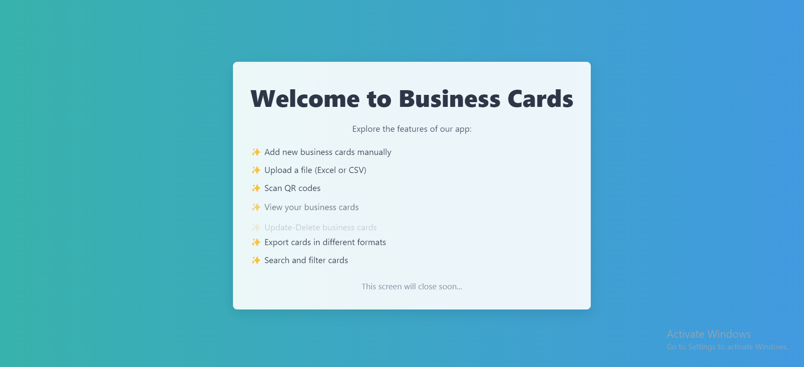
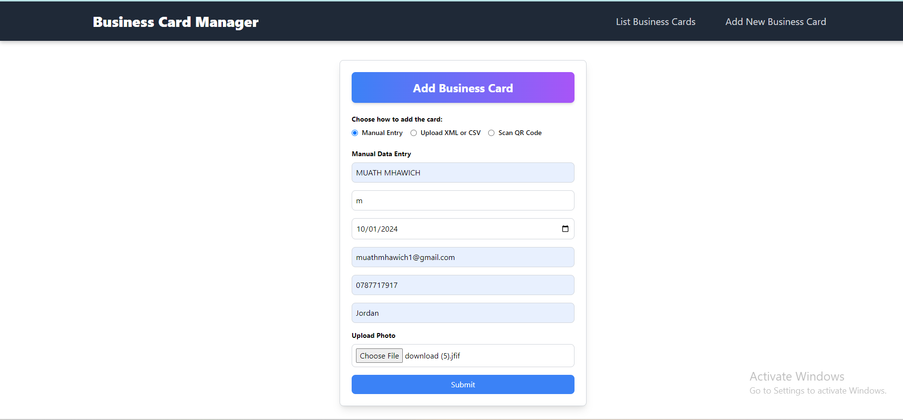
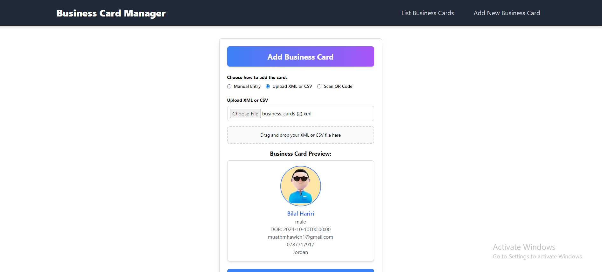
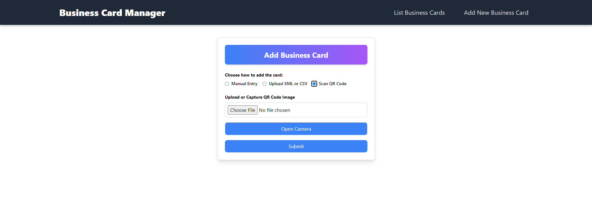
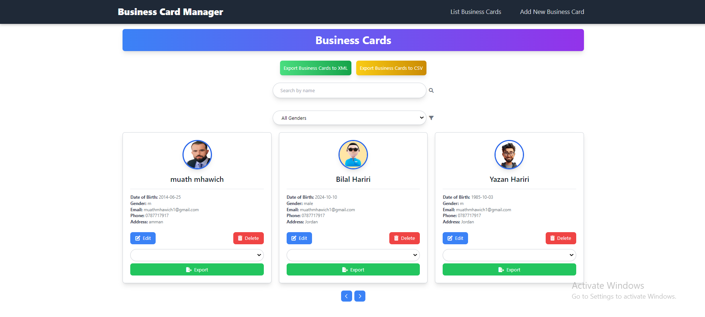
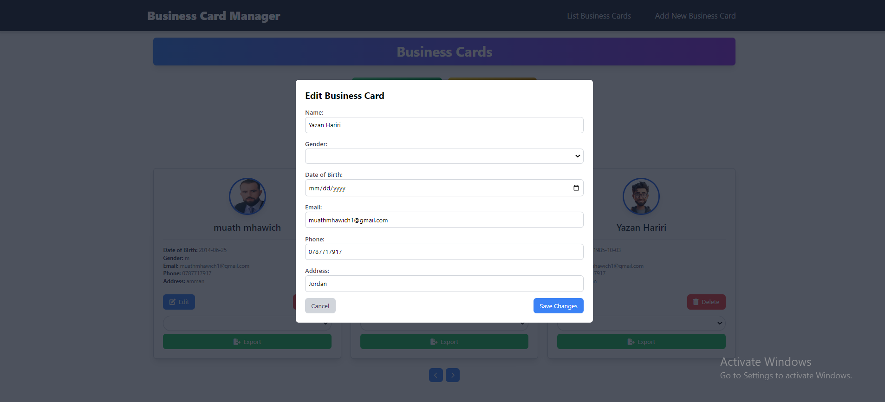
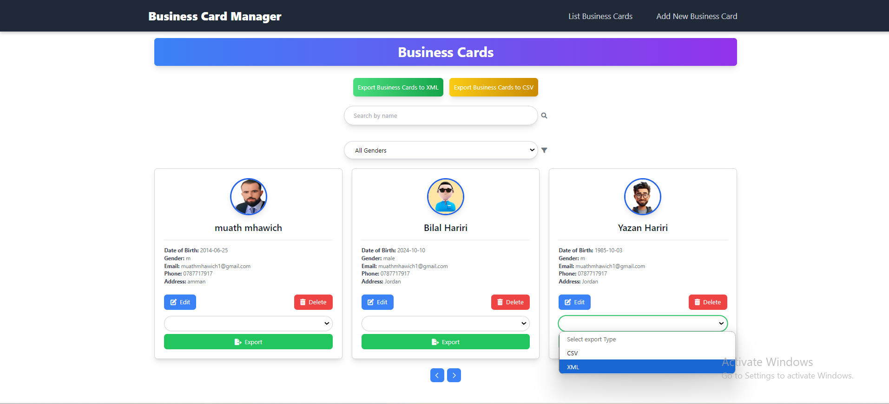

# Business Cards Project
## 🚀 Demo

You can view the live demo of the **BusinessCardManager** application at the following link:

[BusinessCardManager Demo](http://business-card-manager.vercel.app/list-cards)

### Note on Compatibility
Please be aware that due to an HTTPS compatibility issue, there may be limitations in the functionality of the application when making requests from the frontend to the backend server. This can affect features that rely on API calls. We are actively working to resolve this issue to enhance the overall user experience.

Thank you for your understanding!

## 🛠️ Deployment

This application is deployed using **Vercel**. 

[Vercel.com](https://vercel.com/)


## Overview
The Business Cards project is a web application designed to enable users to create and manage business cards effortlessly. Developed using the Angular framework, the application aims to simplify the sharing of professional information while providing a modern and user-friendly experience.

## Features
- **User-Friendly Interface:** Attractive and easy-to-use design ensures a seamless user experience.
- **Add Business Cards:** Users can add their business cards in four ways:
  - **📝 Manual Entry:** Fill in the required fields to create a new business card.
  - **📂 File Upload:** Import business cards by uploading XML or CSV files.
  - **📷 QR Code Scanning:** Scan a QR code to extract and create a business card automatically.
- **🔍 View and Filter Business Cards:** Users can view an organized display of business cards, apply filters, and search for specific cards.
- **📤 Export Options:** Export business cards in XML or CSV format for easy sharing and backup.
- **Data Retrieval:** Allows users to retrieve saved business cards from the server.

## Project Structure
The project is organized into several key components:
- **src/**: Contains the main application files.
  - **app/**: Contains the core Angular components and services.
  - **assets/**: Holds static assets like images and styles.
  - **environments/**: Configuration files for different environments (development and production).
- **angular.json**: Configuration file for Angular CLI.
- **package.json**: Lists dependencies and scripts for the project.

## Technologies Used
- **Angular**: A powerful framework for building dynamic web applications. 
- **RxJS**: For handling asynchronous data streams and event-driven programming. 
- **Tailwind CSS**: A utility-first CSS framework for designing responsive user interfaces with custom styling. 

## Setup Instructions
1. Clone the repository:
   ```bash
   git@github.com:muathmm/business-card-manager-frontend.git
2. Install dependencies:
   ```bash
   cd YOUR_REPOSITORY_NAME
    npm install

3. Run the application:
   ```bash
   ng serve

## Contribution
Contributions are welcome! If you have any suggestions or new features, feel free to open a pull request.

## Screenshots
### Home Page


### Add Business Card




### View Business Cards





## Live Deployment
You can view the live application at Vercel.


## Conclusion

The Business Cards Project provides a comprehensive solution for creating and managing digital business cards. With its user-friendly interface and multiple card creation methods, users can easily maintain their professional information. The project leverages modern web technologies like Angular and Tailwind CSS, ensuring a responsive and intuitive user experience. Whether you're looking to simplify the process of sharing contact information or seeking an efficient way to manage your business cards, this application is designed to meet those needs effectively.